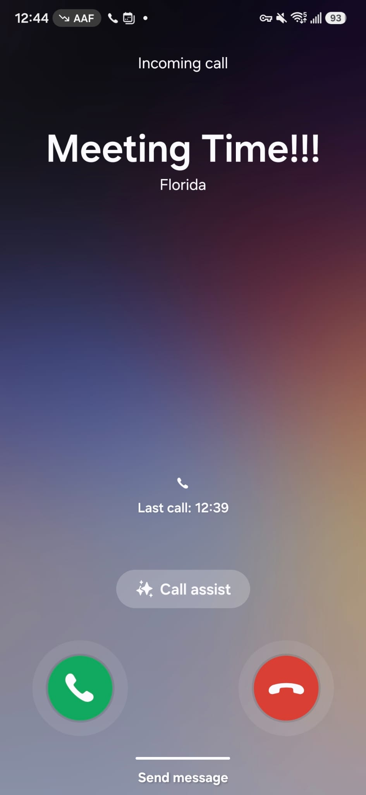

# meetingtime

[](https://github.com/klahrich/meetingtime/actions/workflows/ci.yml)
[](LICENSE)
[](https://www.python.org/)

Phone-call reminders **1 minute before every meeting**, across all Google Calendars
linked to one Google account. Built with Google Calendar API + Twilio, runs on
Windows via Task Scheduler (stateless minute-check every 60s).

<p align="center">
  
</p>

## How it works

Every 60 seconds, `src/main.py` asks every (non-blocklisted) Google Calendar for
events starting ~60 seconds from now, filters out all-day / declined / "free" /
duplicate events, and places a Twilio call with a spoken meeting name and start
time. A small state file (`state/seen.json`) guarantees no double-calls.

## Setup

Prerequisites: [uv](https://docs.astral.sh/uv/), a Google account, and a **Twilio
account** (free trial works — see step 2; calls cost ~$0.01–0.02/min on paid plans).

1. **Google Cloud**: create a project, enable **Google Calendar API**, configure the
   OAuth consent screen (External, add yourself as test user), create an
   **OAuth client ID (Desktop app)** and download the JSON as
   `gcp-remindme-oauth-client.json` in the repo root. (Already done for this repo.)
2. **Twilio**: sign up at [twilio.com](https://www.twilio.com/try-twilio) (the
   trial gives you free credit). Then:
   - **Buy a phone number** with *Voice* capability (Console → Phone Numbers →
     Buy a number; ~$1.15/mo, covered by trial credit). Calls fail with
     "source phone number not verified" if you skip this.
   - **Verify the number you want to be called on** (Console → Phone Numbers →
     Verified Caller IDs). Trial accounts can only call verified numbers.
   - Copy `.env.example` to `.env` and fill in your Account SID, Auth Token,
     Twilio number (`TWILIO_FROM_NUMBER`) and your number (`TWILIO_TO_NUMBER`).
   - Trial limitation: a recorded Twilio preamble plays before your message on
     every call. Upgrading removes it.
3. **Install deps**: `uv sync`
4. **First run / OAuth consent** (opens a browser once, token cached in `token.json`):
   ```
   uv run src/main.py --dry-run
   ```
5. **Verify Twilio** (places one real call immediately):
   ```
   uv run src/main.py --test-call "Test Meeting"
   ```
6. **Schedule it** (registers the every-minute task):
   ```
   powershell -ExecutionPolicy Bypass -File scripts/setup_task.ps1
   ```

Alternative to Task Scheduler: `uv run scripts/loop_runner.py`

## Configuration (`.env`)

| Var | Default | Meaning |
|---|---|---|
| `TWILIO_ACCOUNT_SID` / `TWILIO_AUTH_TOKEN` | — | Twilio credentials (required) |
| `TWILIO_FROM_NUMBER` / `TWILIO_TO_NUMBER` | — | Twilio number / number to call (required) |
| `LEAD_SECONDS` | `60` | call this long before event start |
| `WINDOW_SECONDS` | `60` | detection window; keep = scheduler interval |
| `SKIP_FREE_EVENTS` | `true` | skip events marked "free" |
| `CALENDAR_BLOCKLIST` | `holiday,birthday` | skip calendars matching these substrings |

## Platform support

- **Windows** — supported (Task Scheduler, runs hidden)
- **Linux / macOS** — **not supported yet** (no scheduler integration). The core
  check is platform-independent, so this is mostly a matter of wiring up cron /
  launchd. Want it? [Open an issue](https://github.com/klahrich/meetingtime/issues/new?template=feature_request.md)
  — interest will prioritize it.

## Contributing

Contributions welcome! See [CONTRIBUTING.md](CONTRIBUTING.md) for dev setup,
safe testing (dry-run mode), and PR guidelines. Licensed under [MIT](LICENSE).

## Notes & limitations

- The PC must be **awake** at meeting time — no calls while asleep/off.
- Twilio **trial** accounts prepend a recorded message and can only call verified numbers.
- Secrets (`.env`, OAuth JSON, `token.json`) are gitignored; the repo is public — keep it that way.
- Logs: `state/run.log`.
